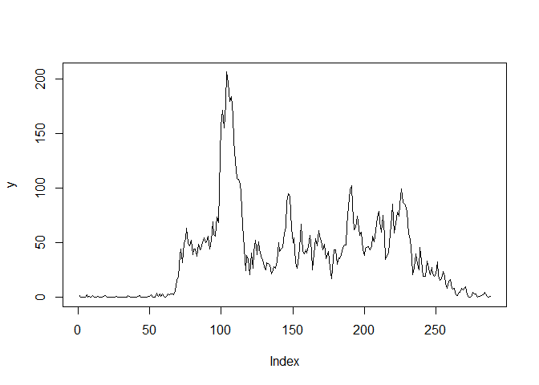
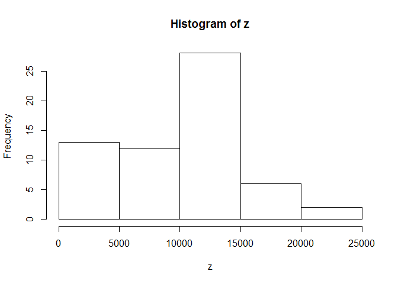
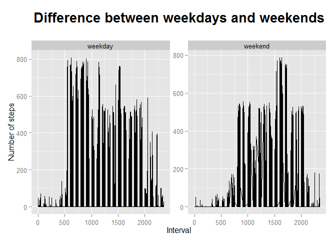

# Reproducible Research - Peer Assessment 1
Yilun Zhang  
Wednesday, October 15, 2014  


### Loading and preprocessing the data

```r
library(ggplot2)
data <- read.csv("activity.csv")
```


### What is mean total number of steps taken per day?

```r
x <- tapply(data$steps,data$date,sum,na.rm=T)
hist(x)
```

 

```r
mean(x)
```

```
## [1] 9354.23
```

```r
median(x)
```

```
## [1] 10395
```


### What is the average daily activity pattern?

```r
y <- tapply(data$steps,data$interval,mean,na.rm=T)
plot(y,type="l")
```

 

From the plot, approximately, interval 100 contains the maximum number of steps. 

### Imputing missing values (Using mean steps of each day)

```r
sum(is.na(data$steps))
```

```
## [1] 2304
```

```r
full <- data
for (day in unique(full$date)) {
  sub <- full[full$date==day,]
  if (nrow(sub[is.na(sub$steps)==T,]) > 0){
    m <- mean(sub$steps,na.rm=T)
    if (is.nan(m)) {
      m <- 0
    }
    full[full$date==day & is.na(full$steps)==T,]$steps <- m
  }
}
z <- tapply(full$steps,full$date,sum,na.rm=T)
hist(z)
```

 

```r
mean(z)
```

```
## [1] 9354.23
```

```r
median(z)
```

```
## [1] 10395
```

According to the plots, mean values, and median values, the imputation of missing values didn't impact those statistics since I used the mean number of steps for each day.


### Are there differences in activity patterns between weekdays and weekends?

```r
full$date <- as.Date(full$date)
full$weekday <- weekdays(full$date) %in% c("Monday","Tuesday","Wednesday","Thursday","Friday")
full[full$weekday == TRUE,]$weekday <- "weekday"
full[full$weekday == FALSE,]$weekday <- "weekend"
full$weekday <- as.factor(full$weekday)

ggplot(full,aes(x=interval,y=steps)) +
  geom_line() +
  facet_wrap(~ weekday,scale="free") +
  labs(y="Number of steps",x="Interval") +
  ggtitle("Difference between weekdays and weekends\n") +
  theme(plot.title = element_text(lineheight=1,face="bold",
                                  color="black",size=20))
```

 

From the plot, we noticed that during the weekdays, activities happen more during early times; during the weekeds, activities happen more duing late times.
